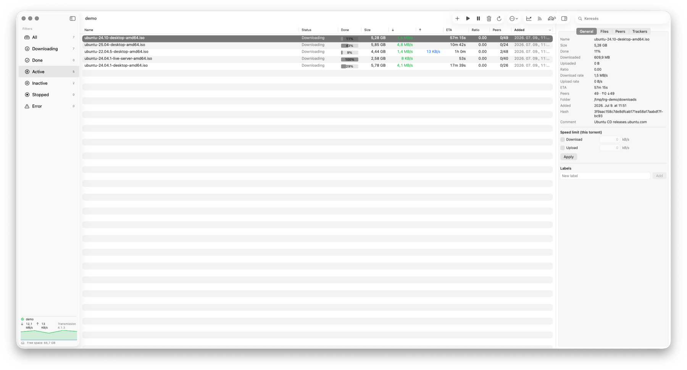

# Transmission Remote GUI


[](https://github.com/epaxpax/transmission-remote-gui/releases)
[](LICENSE)
[](https://github.com/epaxpax/transmission-remote-gui/actions/workflows/ci.yml)

Native **SwiftUI macOS** remote GUI for the [Transmission](https://transmissionbt.com/)
BitTorrent daemon, over the RPC protocol. A modern, from-scratch macOS reimagining of the
classic [transgui](https://github.com/transmission-remote-gui/transgui) (Lazarus/Free Pascal).

> **Clean-room reimplementation:** only the features were used as reference, no code from
> other projects. The entire source was written independently in Swift.

*Magyar leírás: [README.hu.md](README.hu.md)*



## Features

- Torrent list with columns (name, status, progress, size, ↓/↑ rate, ETA, ratio, peers) and fast native sorting
- Sidebar filters with counts (All / Downloading / Done / Active / Inactive / Stopped / Error), plus **label (category) filters**
- Search within the list
- Add torrents via **magnet link / URL**, **`.torrent` file**, or **drag & drop** onto the window
- Start / stop / remove (optionally along with data), **verify**, and **reannounce** (toolbar "More actions" menu)
- **Details panel** (toggled with ⌘I) with tabs: **General / Files / Peers / Trackers**
  - Per-file download selection and priority; **per-torrent speed limit**; **labels/categories** editing
- **RSS auto-downloader** — watched feeds + title-match rules (substring or `/regex/`) → automatic torrent add, with dedup
- **mTLS client-certificate** authentication (optional `.p12` per server) for a reverse proxy that requires it
- **Speed graph** — a live mini-chart in the sidebar, a detailed **Statistics panel**, and a Stats-style **menu-bar popover**
- **Sequential ("streaming") download** (Transmission 4.1+) — pieces download in order so media can be watched while still downloading; no official GUI/Web UI exposes this yet
- **Multiple servers**, managed in Settings; passwords stored in the **Keychain**; **auto-connect** to the last used server on launch
- Full **session settings** (speed, peers, network, queues, download, seeding) — written immediately via `session-set`
- **Turtle mode** (alternative speed limits) with one click, plus a **bandwidth scheduler** (turbo on/off by time of day and day of week)
- **Notification** when a torrent finishes downloading
- **Menu bar (tray) icon** with ↓/↑ speeds and a live graph; the **Dock icon can be hidden** (app lives in the menu bar only)
- UI zoom (⌘+ / ⌘− / ⌘0), automatic refresh with configurable interval
- **Bilingual UI**: English and Hungarian, switchable at runtime (Settings → General)

## Architecture

| Layer | Contents |
|-------|----------|
| `TransmissionKit` | UI-independent core: `RPCClient` (409 handshake, basic auth), Codable models, typed RPC wrappers, formatters. Testable without a daemon. |
| `TransmissionRemoteGUI` | SwiftUI app: `AppModel` (`@Observable`), `NavigationSplitView` + inspector, tray, settings. |
| `KitTests` | Standalone test runner (the CLT toolchain has no XCTest). |

The client targets the **classic** Transmission RPC protocol
(`{"method":"torrent-get","arguments":{…},"tag":N}`, camelCase fields), used by Transmission
3.x and 4.0.x (4.1+ daemons work too, backwards compatibly).

## Requirements

- macOS 14+
- Swift 6 toolchain (full Xcode **not** required — Command Line Tools are enough)

## Build / run / test

```sh
swift build                            # compile
swift run TransmissionRemoteGUI        # run the app (for development)
swift run KitTests                     # unit tests (RPC envelope, 409 handshake, model decoding, URL normalization)
```

### Installable `.app` bundle

A double-clickable application can be produced even without full Xcode:

```sh
./Scripts/build-app.sh          # → "dist/Transmission Remote GUI.app" (release build, icon, ad-hoc signing)
./Scripts/build-app.sh --dmg    # + portable .dmg
```

Then drag **Transmission Remote GUI.app** into `/Applications`. Due to ad-hoc signing the
bundle runs on your own machine; distributing to other Macs requires an Apple Developer ID
and notarization.

### Homebrew

```sh
brew install --cask epaxpax/tap/transmission-remote-gui-macos
```

Installs the app into `/Applications`. Ad-hoc signed (not notarized) — the cask strips the
download quarantine so it launches without a Gatekeeper prompt. The `-macos` suffix avoids a
name clash with the (deprecated) `transmission-remote-gui` cask in Homebrew core.

### Testing against a real daemon

```sh
brew install transmission-cli
transmission-daemon --foreground --port 9091
# then in the app: Settings (⌘,) → Servers → +  →  127.0.0.1 : 9091
```

## Roadmap

- Download queue reordering
- Move torrent (set-location), tracker add/remove, rename
- Watch folder
- Right-click context menu, column customization
- JSON-RPC 2.0 (Transmission 4.1+) support

## License

[MIT](LICENSE) © 2026 Viktor Falcsik
