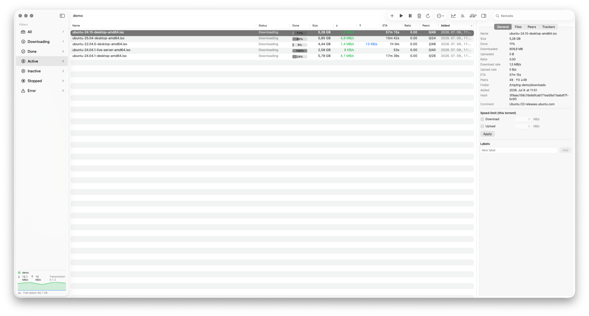
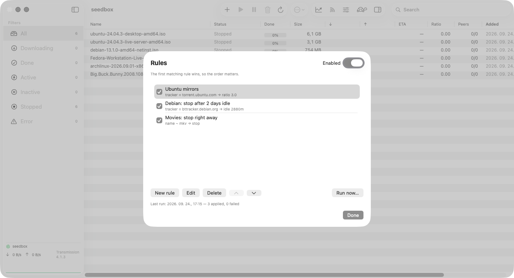
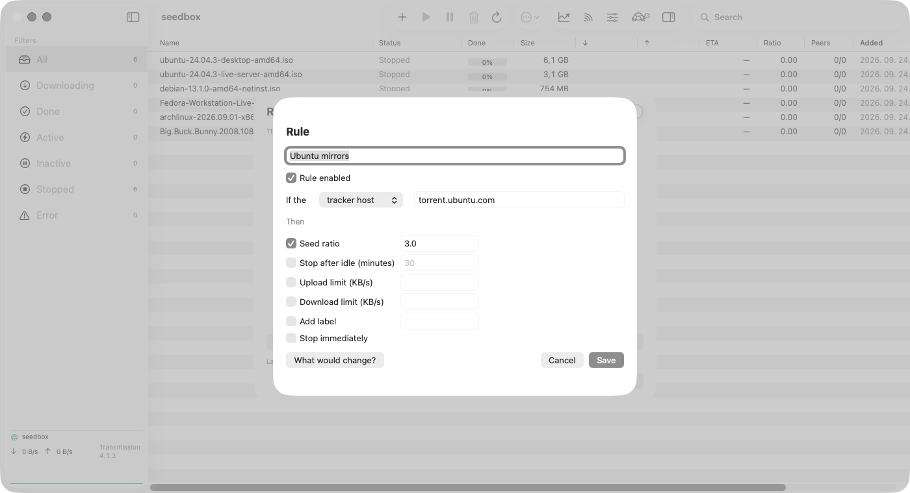
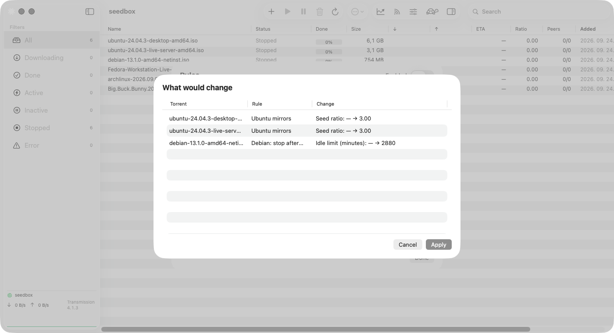

# Transmission Remote GUI


[](https://github.com/epaxpax/transmission-remote-gui/releases)
[](LICENSE)
[](https://github.com/epaxpax/transmission-remote-gui/actions/workflows/ci.yml)

Native **SwiftUI macOS** remote GUI for the [Transmission](https://transmissionbt.com/)
BitTorrent daemon, over the RPC protocol. A modern, from-scratch macOS reimagining of the
classic [transgui](https://github.com/transmission-remote-gui/transgui) (Lazarus/Free Pascal).

> **Clean-room reimplementation:** only the features were used as reference, no code from
> other projects. The entire source was written independently in Swift.

*Magyar leírás: [README.hu.md](README.hu.md)*



## Features

- Torrent list with columns (name, status, progress, size, ↓/↑ rate, ETA, ratio, peers, added, **last activity**) and fast native sorting
- **Customizable columns**: right-click the list header to show/hide columns — extra ones: completed on, remaining, downloaded, uploaded, download folder, labels; order, widths and visibility are remembered, *Default Columns* resets them
- Sidebar filters with counts (All / Downloading / Done / Active / Inactive / Stopped / Error), plus **label (category) filters**
- Search within the list
- Add torrents via **magnet link / URL**, **`.torrent` file**, or **drag & drop** onto the window
- **Open With / double-click** a `.torrent` in Finder, or click a **magnet link** in the browser — added to the current server (queued until connected if the app was closed), without extra windows
- Start / stop / remove (optionally along with data), **verify**, and **reannounce** — from the toolbar or the row's **right-click context menu**
- **Right-click context menu** on torrent rows, which also offers **move** (`torrent-set-location`, with an optional "move the files" switch), **rename** (`torrent-rename-path`), and copy name / hash. A click inside a multi-selection acts on the whole selection, like Finder.
- **Details panel** (toggled with ⌘I) with tabs: **General / Files / Peers / Trackers**
  - Per-file download selection and priority; **per-torrent speed limit**; **labels/categories** editing
- **Torrent rules** — per-tracker, per-label or per-name rules that set seed ratio, idle limit, speed limits and labels, or stop the torrent. First match wins, each torrent is classified once (manual changes are never overwritten), and every change is shown in a **dry run** first. Ratio/idle limits are enforced by the daemon, so they keep working while the app is closed. [Screenshots ↓](#torrent-rules)
- **RSS auto-downloader** — watched feeds + title-match rules (substring or `/regex/`) → automatic torrent add, with dedup
- **mTLS client-certificate** authentication (optional `.p12` per server) for a reverse proxy that requires it
- **Speed graph** — a live mini-chart in the sidebar, a detailed **Statistics panel**, and a Stats-style **menu-bar popover**
- **Sequential ("streaming") download** (Transmission 4.1+) — pieces download in order so media can be watched while still downloading; no official GUI/Web UI exposes this yet
- **Multiple servers**, managed in Settings; passwords stored in the **Keychain**; **auto-connect** to the last used server on launch
- Full **session settings** (speed, peers, network, queues, download, seeding) — written immediately via `session-set`
- **Turtle mode** (alternative speed limits) with one click, plus a **bandwidth scheduler** (turbo on/off by time of day and day of week)
- **Notification** when a torrent finishes downloading
- **Menu bar (tray) icon** with ↓/↑ speeds and a live graph; the **Dock icon can be hidden** (app lives in the menu bar only)
- UI zoom (⌘+ / ⌘− / ⌘0), automatic refresh with configurable interval
- **Bilingual UI**: English and Hungarian, switchable at runtime (Settings → General)

## Torrent rules

<p>
  
  
</p>
<p></p>

## Architecture

| Layer | Contents |
|-------|----------|
| `TransmissionKit` | UI-independent core: `RPCClient` (409 handshake, basic auth), Codable models, typed RPC wrappers, formatters. Testable without a daemon. |
| `TransmissionRemoteGUI` | SwiftUI app: `AppModel` (`@Observable`), `NavigationSplitView` + inspector, tray, settings. |
| `KitTests` | Standalone test runner (the CLT toolchain has no XCTest). |

The client targets the **classic** Transmission RPC protocol
(`{"method":"torrent-get","arguments":{…},"tag":N}`, camelCase fields), used by Transmission
3.x and 4.0.x (4.1+ daemons work too, backwards compatibly).

## Requirements

- macOS 14+
- Swift 6 toolchain (full Xcode **not** required — Command Line Tools are enough)

## Build / run / test

```sh
swift build                            # compile
swift run TransmissionRemoteGUI        # run the app (for development)
swift run KitTests                     # unit tests (RPC envelope, 409 handshake, model decoding, URL normalization, rule engine)
```

### Installable `.app` bundle

A double-clickable application can be produced even without full Xcode:

```sh
./Scripts/build-app.sh          # → "dist/Transmission Remote GUI.app" (release build, icon, ad-hoc signing)
./Scripts/build-app.sh --dmg    # + portable .dmg
```

Then drag **Transmission Remote GUI.app** into `/Applications`. Due to ad-hoc signing the
bundle runs on your own machine; distributing to other Macs requires an Apple Developer ID
and notarization.

### Homebrew

```sh
brew install --cask epaxpax/tap/transmission-remote-gui-macos
```

Installs the app into `/Applications`. Ad-hoc signed (not notarized) — the cask strips the
download quarantine so it launches without a Gatekeeper prompt. The `-macos` suffix avoids a
name clash with the (deprecated) `transmission-remote-gui` cask in Homebrew core.

### UI tests (no Xcode needed)

`Scripts/uitest/` drives an **isolated copy** of the built app (separate bundle id and home —
your own servers and settings are never touched) against a throw-away Transmission daemon in
Docker, via Accessibility, real mouse input and screenshots:

```sh
./Scripts/build-app.sh
./Scripts/uitest/helper/build-helper.sh        # once; then allow "TRGUI UITest Helper" in
                                               # System Settings → Privacy & Security → Accessibility
python3 Scripts/uitest/test_open_with.py       # Open With / magnet links
python3 Scripts/uitest/test_context_menu.py    # row context menu on every column
python3 Scripts/uitest/test_columns.py         # header menu: show/hide columns, persistence, reset
python3 Scripts/uitest/test_rules.py "dist/Transmission Remote GUI.app"
UITEST_DAEMON=tr4 python3 Scripts/uitest/test_rules.py …   # against Transmission 4.x instead of 3.00
```

### Testing against a real daemon

```sh
brew install transmission-cli
transmission-daemon --foreground --port 9091
# then in the app: Settings (⌘,) → Servers → +  →  127.0.0.1 : 9091
```

## Roadmap

- Download queue reordering
- Tracker add / remove
- Watch folder
- JSON-RPC 2.0 (Transmission 4.1+) support

## License

[MIT](LICENSE) © 2026 Viktor Falcsik
