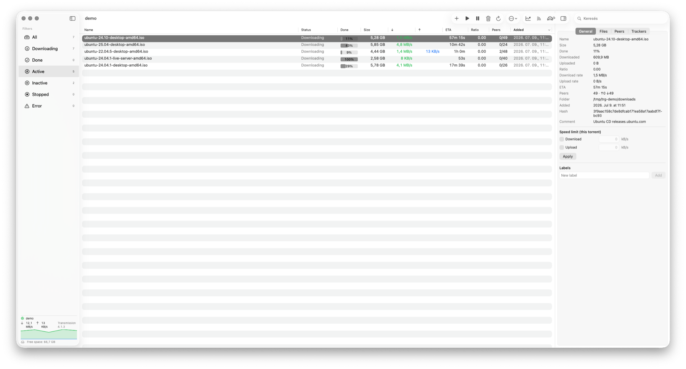
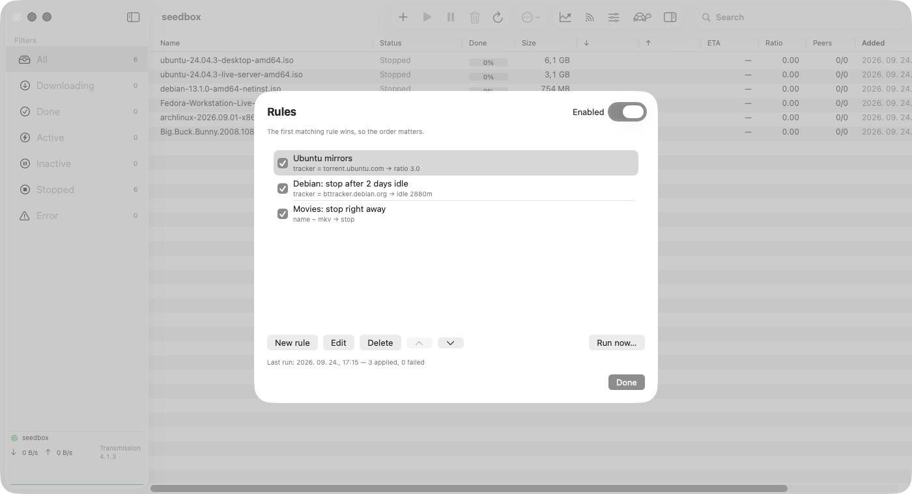
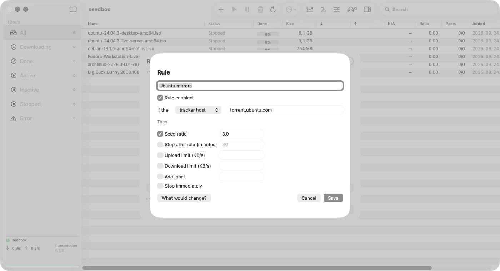
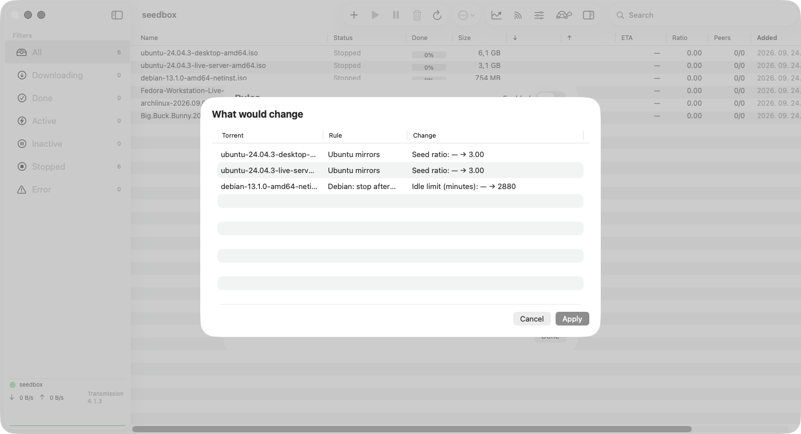
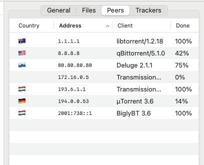

# Transmission Remote GUI


[](https://github.com/epaxpax/transmission-remote-gui/releases)
[](LICENSE)
[](https://github.com/epaxpax/transmission-remote-gui/actions/workflows/ci.yml)

基于 **SwiftUI 的原生 macOS** 远程图形客户端，通过 RPC 协议管理
[Transmission](https://transmissionbt.com/) BitTorrent 服务端。
这是对经典 [transgui](https://github.com/transmission-remote-gui/transgui)
（Lazarus/Free Pascal）的现代化 macOS 重新实现，从零编写。

> **独立重新实现（Clean-room reimplementation）：** 仅参考其他项目的功能，不使用其代码。
> 全部源代码均使用 Swift 独立编写。

*语言：[English](README.md) | [Magyar](README.hu.md) | 简体中文*



## 功能

- 种子列表包含名称、状态、完成进度、大小、↓/↑ 速率、预计剩余时间（ETA）、分享率、节点、添加时间和**最后活动**等列，支持快速的原生排序
- **自定义列**：右键点击列表表头即可显示或隐藏各列——还可显示完成时间、剩余大小、已下载、已上传、下载文件夹、**做种者／下载者**（已连接数量及 Tracker 报告的种群总数，例如 `3 (120)`）、Tracker 和标签；列顺序、宽度和显示状态会被保存，可通过*默认列*恢复
- 侧边栏筛选器显示种子数量（全部／下载中／完成／活动／空闲／已停止／错误），并提供带数量的 **Tracker**、**下载文件夹**和 **标签（分类）** 筛选——这些筛选可以相互组合，也可与状态筛选组合；每个分组的 **全部……** 行（或再次点击已选中的行）只清除该分组的筛选条件
- 在列表中搜索
- 通过 **Magnet 链接／URL**、**`.torrent` 文件**或**拖放**到窗口添加种子
- 在 Finder 中通过**打开方式／双击**打开 `.torrent` 文件，或在浏览器中点击 **Magnet 链接**，即可添加到当前服务器，不会额外打开窗口；如果 App 尚未运行，会在连接成功后再添加
- 从工具栏或种子行的**右键菜单**执行开始／停止／删除（可选择同时删除数据）、**校验**和**重新通告 Tracker（reannounce）**
- 种子行的**右键菜单**还支持**移动**（`torrent-set-location`，可选择是否实际移动文件）、**重命名**（`torrent-rename-path`）以及复制名称／哈希值；与 Finder 一样，在多选范围内点击时，操作会作用于整个选中范围
- **详细信息面板**（⌘I 显示或隐藏），包含**常规／文件／节点／Tracker**标签页
  - 节点显示**国家／地区旗帜**（使用内置的离线国家／地区数据，详见[节点](#节点)）；节点和 Tracker 标签页的所有列均可**排序**，地址按数值顺序排列
  - 按文件选择是否下载并设置优先级；设置**单个种子的速度限制**；编辑**标签／分类**
- **种子规则**——根据 Tracker、标签或名称设置做种分享率、空闲时间限制、速度限制和标签，或停止种子；按顺序采用第一条匹配的规则，每个种子只自动归类一次（不会覆盖手动修改），所有变更都会先通过**预演**展示；分享率／空闲时间限制由服务端执行，因此关闭 App 后仍然生效。[截图 ↓](#种子规则)
- **RSS 自动下载器**——订阅源配合标题匹配规则（子字符串或 `/regex/`）自动添加种子，并避免重复添加
- **mTLS 客户端证书**认证：可为每个服务器配置 `.p12` 证书，用于要求客户端证书的反向代理
- **速度图表**——侧边栏中的实时迷你图表、详细的**统计面板**以及类似 Stats 的**菜单栏弹出面板**
- **顺序（“流式”）下载**（Transmission 4.1+）——按顺序下载数据块，以便在下载过程中观看媒体；官方 GUI／Web UI 目前尚未提供这一操作入口
- **多服务器**管理：在设置中配置服务器，密码保存在 **Keychain（钥匙串）** 中；启动时**自动连接**上次使用的服务器
- **在 Finder 中显示** — 为每台服务器配置远程到本地的[路径映射](docs/path-mappings.md)，定位已挂载共享中的下载内容；双击行为保持不变
- 完整的 **session（会话）设置**：速度、节点、网络、队列、下载和做种设置，通过 `session-set` 即时写入服务端
- 一键切换 **Turtle 模式（备用速度限制）**，并提供**带宽计划**，按时段和星期几自动开启／关闭备用速度模式
- 种子下载完成时发送**通知**
- **菜单栏（托盘）图标**显示 ↓/↑ 速度和实时图表；可**隐藏 Dock 图标**，仅在菜单栏中运行
- 界面缩放（⌘+／⌘−／⌘0），按可配置的时间间隔自动刷新
- **多语言界面**：支持英语、匈牙利语和简体中文，可在运行时切换（设置 → 常规 → 语言）；语言包独立且可复用，详见[语言包说明](docs/localization.md)
- **检查更新**：每天一次，也可从 App 菜单选择*检查更新…*；发现新版本后仅在侧边栏显示一个小链接，不弹窗；通过 Homebrew 安装的用户使用 `brew upgrade` 更新，*跳过此版本*的选择会被保存
- **自愿开启的匿名使用统计**：默认关闭，只有在设置 → 常规中开启后才会发送，详见[隐私](#隐私)

## 种子规则

<p>
  
  
</p>
<p></p>

## 节点

<p></p>

节点的国家／地区由 **App 在本地查询**，查询表基于 [IP Geolocation by DB-IP](https://db-ip.com) 的 *IP to Country Lite* 数据构建（采用 [CC BY 4.0](https://creativecommons.org/licenses/by/4.0/) 许可），并随每次发布更新。不会向外部发送节点地址。私有地址和未知地址不显示旗帜；将指针悬停在旗帜上即可查看国家／地区名称。

## 隐私

App 会与配置的 Transmission 服务端通信；只有在获得你的同意或按相应设置启用时，才会访问以下两个外部服务：

- **节点国家／地区旗帜**不需要外部服务：查询完全在 App 内置的数据表中完成。
- **检查更新**（默认开启，可在设置 → 常规中关闭）：每天一次向 `api.github.com` 查询最新版本号，不发送与你或种子有关的数据，也不会弹窗；有新版本时只在侧边栏显示一个小链接。
- **匿名使用统计**（默认关闭，也不会通过弹窗请求开启；可在设置 → 常规中启用）：每天最多向 [GoatCounter](https://www.goatcounter.com/) 发送一次请求，仅包含 **App 版本、macOS 主版本和服务端的主版本.次版本**，例如 `/app/0.1.9/macos-15/tr-4.1`；不包含标识符、Cookie、语言设置、服务器地址或种子数据。与其他网络请求一样，该请求来自你的 IP 地址；GoatCounter 最多据此推导国家／地区，不保存 IP 地址。你可以随时关闭此功能。

## 架构

| 层 | 内容 |
|-------|----------|
| `TransmissionKit` | 不依赖界面的核心：`RPCClient`（409 握手、Basic Auth）、Codable 模型、类型化 RPC 封装和格式化工具；无需服务端即可测试。 |
| `TransmissionLocalization` | 不依赖界面的语言包、语言区域匹配、翻译回退和运行时语言设置。 |
| `TransmissionRemoteGUI` | SwiftUI App：`AppModel`（`@Observable`）、`NavigationSplitView`、检查器、菜单栏图标和设置。 |
| `KitTests` | 独立测试运行器（Command Line Tools 工具链不包含 XCTest）。 |
| `LocalizationTests` | 独立测试运行器，验证翻译覆盖、语言选择、偏好持久化和状态格式化。 |

客户端使用**经典 Transmission RPC 协议**
（`{"method":"torrent-get","arguments":{…},"tag":N}`，字段采用 camelCase 命名），
适用于 Transmission 3.x 和 4.0.x；4.1+ 服务端也可通过向后兼容模式使用。

## 环境要求

- macOS 14+
- 自行编译时需要 Swift 6 工具链（**不需要**完整 Xcode，Command Line Tools 即可）

## 构建／运行／测试

```sh
swift build                            # 编译
swift run TransmissionRemoteGUI        # 运行 App（用于开发）
swift run KitTests                     # 单元测试（RPC 消息封装、409 握手、模型解码、URL 规范化、规则引擎）
swift run LocalizationTests            # 语言包、翻译回退、中文覆盖、偏好和状态
```

### 可安装的 `.app` 应用包

即使不安装完整 Xcode，也可以生成可双击启动的应用：

```sh
./Scripts/build-app.sh          # → "dist/Transmission Remote GUI.app"（Release 构建、图标、ad-hoc 签名）
./Scripts/build-app.sh --dmg    # 另外生成可分发的 .dmg
```

构建时每月下载一次 DB-IP 的月度国家／地区数据文件（缓存于 `.build/geoip/`），再由 `Scripts/geoip.py` 转换为旗帜查询表；离线构建时可传入已准备好的数据表：`GEOIP_TABLE=<file> ./Scripts/build-app.sh`。

随后将 **Transmission Remote GUI.app** 拖入 `/Applications`。
构建产物采用 ad-hoc 签名，适合在本机使用；如果要通过 Apple Developer ID 签名和公证流程分发给其他 Mac，则需要相应的开发者身份和公证。

### Homebrew

```sh
brew install --cask epaxpax/tap/transmission-remote-gui-macos
```

App 会安装到 `/Applications`。应用采用 ad-hoc 签名（未经公证），cask 会移除下载隔离标记，
使其启动时不出现 Gatekeeper 提示。名称中的 `-macos` 后缀用于避免与 Homebrew core 中
已弃用的 `transmission-remote-gui` cask 冲突。

### 界面测试（无需 Xcode）

`Scripts/uitest/` 通过辅助功能、真实鼠标输入和截图，驱动构建后 App 的**隔离副本**，
并连接 Docker 中用于测试、可丢弃的 Transmission 服务端。
该副本使用独立的 bundle ID 和用户主目录，不会修改你自己的服务器配置和设置：

```sh
./Scripts/build-app.sh
./Scripts/uitest/helper/build-helper.sh        # 只需构建一次；随后为 “TRGUI UITest Helper” 授权：
                                               # 系统设置 → 隐私与安全性 → 辅助功能
python3 Scripts/uitest/test_open_with.py       # 打开方式／Magnet 链接
python3 Scripts/uitest/test_context_menu.py    # 在每一列中测试种子行的右键菜单
python3 Scripts/uitest/test_columns.py         # 表头菜单：列显示／隐藏、持久化、恢复默认
python3 Scripts/uitest/test_filters.py         # 侧边栏 Tracker／文件夹筛选，以及“全部”行
python3 Scripts/uitest/test_peers.py           # 节点标签页：旗帜、排序（通过本地代理提供虚构节点）
python3 Scripts/uitest/test_updates.py         # 检查更新和自愿开启的使用统计（使用本地服务器）
python3 Scripts/uitest/test_rules.py "dist/Transmission Remote GUI.app"
UITEST_DAEMON=tr4 python3 Scripts/uitest/test_rules.py …   # 使用 Transmission 4.x，而非 3.00
```

### 连接实际服务端进行测试

```sh
brew install transmission-cli
transmission-daemon --foreground --port 9091
# 然后在 App 中：设置（⌘,）→ 服务器 → +  →  127.0.0.1 : 9091
```

## 后续计划

- 调整下载队列顺序
- 添加／删除 Tracker
- 监视文件夹（Watch folder）
- 支持 JSON-RPC 2.0（Transmission 4.1+）

## 许可证

[MIT](LICENSE) © 2026 Viktor Falcsik

App 内置的节点国家／地区查询表来源于 [IP Geolocation by DB-IP](https://db-ip.com)，采用 [CC BY 4.0](https://creativecommons.org/licenses/by/4.0/) 许可。
